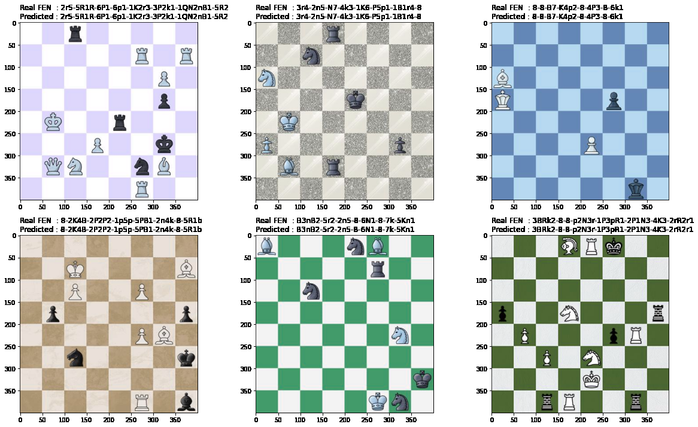

# Chess-FEN
Predicts Forsyth–Edwards Chess Notation from a chess board image, using an SVC model



## Dependencies
### Python
I tested it on `Python 3.7.10` but it should also work with future versions as well (hopefully)
### Modules versions
| Python module | Version |
|---|---|
|numpy|1.19.5|
|cv2|4.1.2|
|matplotlib|3.2.2|
|sklearn|0.22.2.post1|
|joblib|1.0.1|

## Usage
```
$ python3 src/main.py --help
usage: main.py [-h] [--predict PREDICT | --train TRAIN]

Predicts FEN given a chess board image

optional arguments:
  -h, --help         show this help message and exit
  --predict PREDICT  The input image file
  --train TRAIN      Path to a floder of training images
```
## Training data
I used [this](https://www.kaggle.com/koryakinp/chess-positions) dataset by [Pavel Koryakin](https://www.kaggle.com/koryakinp) which is under CC0 license;
Big thanks to Pavel Koryakin.
